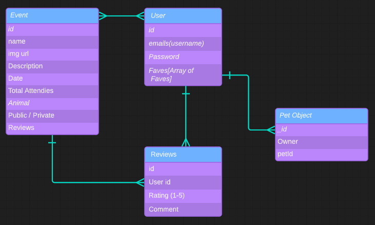
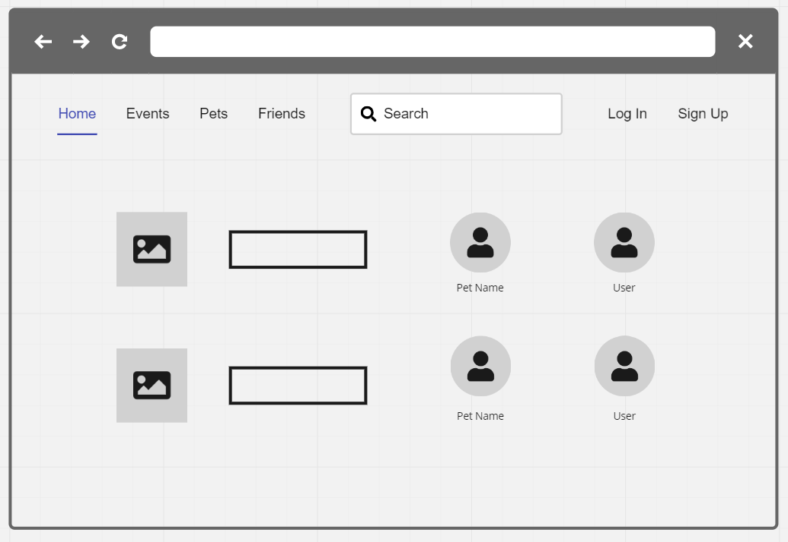
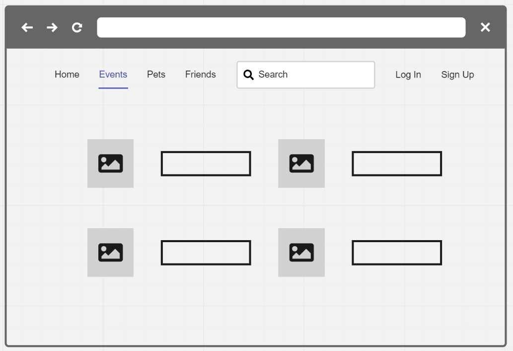
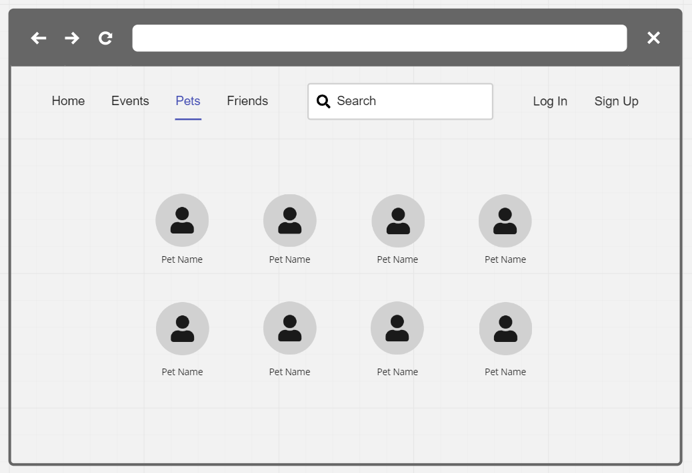
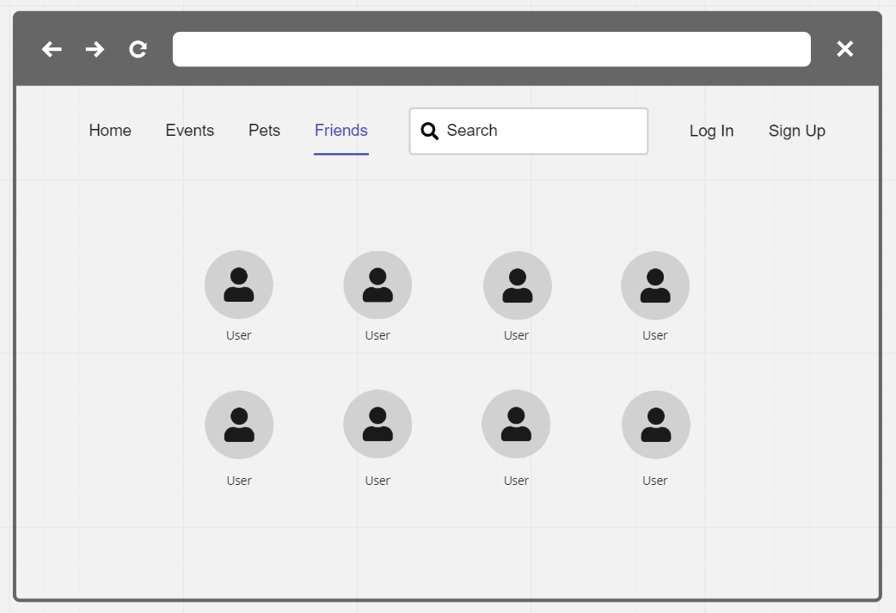

# project-4 Something with Pets and Events
1. When Opening the website, the user will be Asked to Login/SignUp before entering the main website!
2. Once logged in, the user will see events that they are attending, other users that they friended, and other pets that they may be following
3. Clicking on the events tab will bring up a page with Events upcoming and/or Followed Events. You will also be able to Create your own events
4. Clicking on the Pets Tab will Take you to a page of where all the pets you follow will appear
5. Clicking on the Friends tab will bring up all the users that you friended so you can plan events
6. Clicking on your user icon, you can add your own pets

## Technologies Used:
- React
- Bootstrap
- JavaScript
- Cludinary

Link to the API-matching GitHub: 

## ERD

## Wireframe

